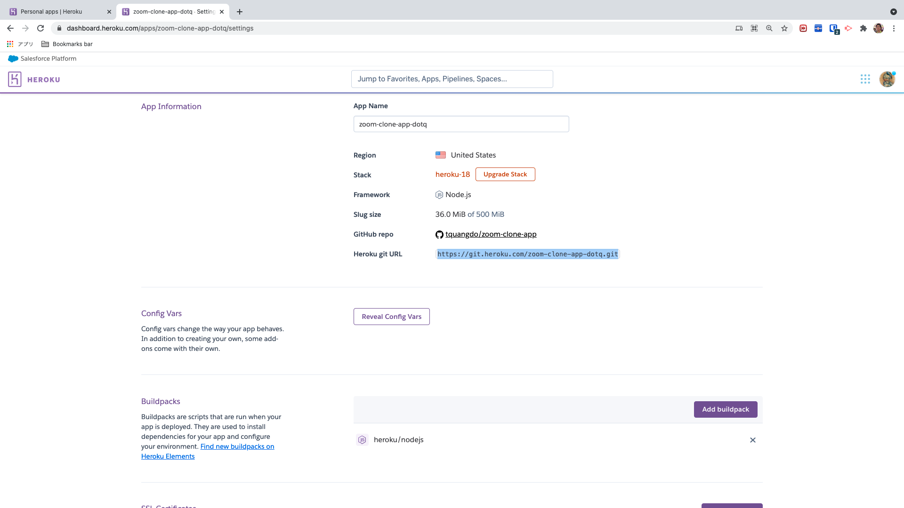

# node-zoom-clone-app 🚀

***********

## deploy local
1. `npm i`
2. `nodemon server`

## heroku

### install
- `npm i -g heroku`
### dashboard on website

***********
### setting
https://github.com/tquangdo/node-zoom-clone-app/blob/master/memo.txt
#### create heroku app & heroku git
1. `heroku create zoom-clone-app-dotq --ssh-git` (need Heroku's login acc: $heroku login)
2. `heroku git:remote -a zoom-clone-app-dotq`

***********
#### check buildpacks
- `heroku buildpacks -a zoom-clone-app-dotq`
- -> `heroku/nodejs`

***********
>if: `heroku buildpacks:set mars/create-react-app -a zoom-clone-app-dotq`
>* `heroku buildpacks -a zoom-clone-app-dotq`
>* ->`mars/create-react-app`
